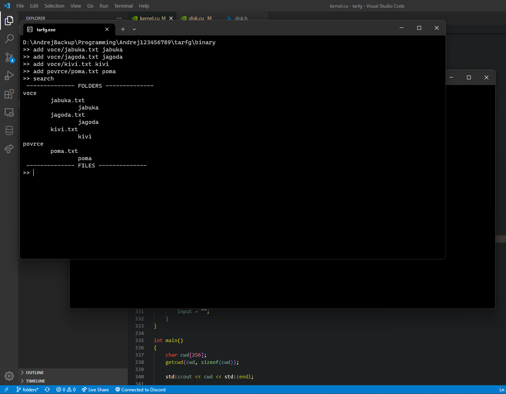

# tarfg

"File system" built around [Tar](https://wiki.osdev.org/Tar) which runs on GPU RAM (Nvidia GPUs for now)

**Demo of tarfg**

## TODO:

-   [ ] GPU
    -   [ ] run on GPU RAM
-   [x] DISK
    -   [x] store files
    -   [x] store folders
-   [x] Tar
    -   [x] untar .tar file
    -   [x] tar .tar file
-   [ ] Other stuff
    -   [ ] multi platform

## Compile & Run

1. Install CUDA (see [this](https://www.youtube.com/watch?v=8sDg-lD1fZQ) video)
2. Open Visual Studio and compile project or use `compile.bat` file

## External dependencies

-   [microtar](https://github.com/rxi/microtar)
